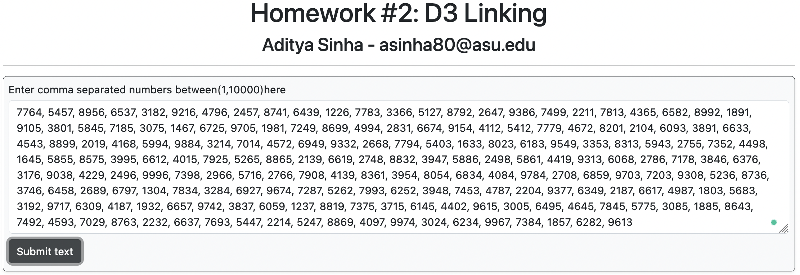

# Homework #2: HeatMap Charts and Adding Interactivity

<br>
<p>The purpose of this homework is to give you practice interactively building and linking visualizations together in D3. By the end of this assignment you should be able to:</p>

<ul>
<li>Dynamically create and parse a number dataset in JavaScript</li>
<li>Visualize the values in a heatmap chart</li>
<li>Dynamically update a chart based on user interactions</li>
<li>Add an interactive tooltip</li>
</ul>

The screenshot below shows an example of what your finished interface will look like.


## Overview

The starter code for this assignment shows three panels on the `index.html` page. The top panel contains a `textarea` html element and a `submit` button. The user can enter a set of text and then click the button. This should create a heatmap chart in the bottom panel. The heatmap chart will visualize the distribution of the entered text number based on their type (i.e. numbers coming at ones place,tens place,hundred place and thousand place). Hovering over a heatmap will show the counts of the selected number.

## Data Description

The text entered into the `textarea` element will consitute the data for your visualizations. You should assume that the entered characters will be of the following types. 
- numbers between 0 to 99999.


As an example, if the user submits the following as their text:

```html
 10,20,100,200,5,9,1567
```

You would count the number of times each vowel appears in the submitted text:

```
Value at ones place:
0:4
1:0
2:0
3:0
4:0
5:1
6:0
7:1
8:0
9:1

Value at tens place:
0:2
1:1
2:1
3:0
4:0
5:0
6:1
7:0
8:0
9:0

Value at hundred place:
0:0
1:1
2:1
3:0
4:0
5:1
6:0
7:0
8:0
9:0

Value at thousand place:
0:0
1:1
2:0
3:0
4:0
5:0
6:0
7:0
8:0
9:0

Value at ten thousand place:
0:0
1:0
2:0
3:0
4:0
5:0
6:0
7:0
8:0
9:0
 ```
Count and store the numbers to a data structure, and create corresponding data structures for the counting the occurance of each number in the text. 

## To complete the assignment

- Clone this code template to your local machine.
- Start a local server and open the `index.html` page.
- Modify the given code according to the instructions below to achieve the requested interface.
- Commit and push the code back to this repository to submit it.


## Step 0: Starting code

When you first run the page, you should see the empty interface. Add your name and email to the top. It's up to you if you want to write your JavaScript code in a separate JS file, or in the main `index.html` file.

## Step 1: Displaying a heatmap chart

When the user clicks on the `Submit` button, you should display a heatmap chart  that show the distrubution of numbers  from the `textarea` (i.e., count of each no entered with respect to units,tens,hundred,thousand and ten thousand place).

- You'll want to first read the entered text from the `textarea` and store it in a set of one or more data structures. Every time the submit button is pressed, you'll need to clear and recreate these.

- Choose a categorical d3 color scale for this chart by picking a color scale from [https://github.com/d3/d3-scale-chromatic](https://github.com/d3/d3-scale-chromatic). For my screenshots, I'm using the `d3.schemeSet3` scale, but you can choose any categorical scale you like.
- When the user mouses over in the heatmap chart, perform one actions: (1) First, centered in the inside of the heatmap, show the count of the selected number count, as shown in the below image.  When the user mouses off of the arc, clear the inside text (i.e., make it blank inside the heatmap chart).


## Step 3: Add a hover tooltip to the heatmap chart

Finally, let's add a tooltip to the heatmap chart. When the user hovers over a heatmap, we'll display the exact count for that number.

The tooltip should show the current letter that's being hovered and its count, styled like the below image. The tooltip should follow the user's mouse as it moves along the bar, and disappear when it's no longer over the bar. You'll want to use mouse events to control this functionality (`mouseover`, `mousemove`, `mouseout`). 

| 🔍 **Hint:** There are multiple ways to implement tooltips. One option is defining a div that's hidden unless you are hovering over a bar; when that happens, you populate the div with the necessary info, change its display to visible, and move it to the appropriate position on the so it follows the mouse's x/y position on the page. See  this page which for an example: [https://bl.ocks.org/d3noob/97e51c5be17291f79a27705cef827da2](https://bl.ocks.org/d3noob/97e51c5be17291f79a27705cef827da2).


## Grading

This assignment is worth 10 points.

- Step 0 is worth 1 point
- Step 1 is worth 5 points
- Step 3 is worth 4 points